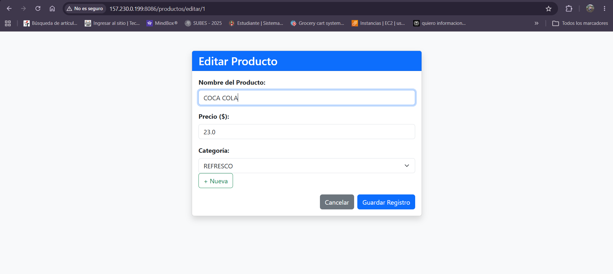
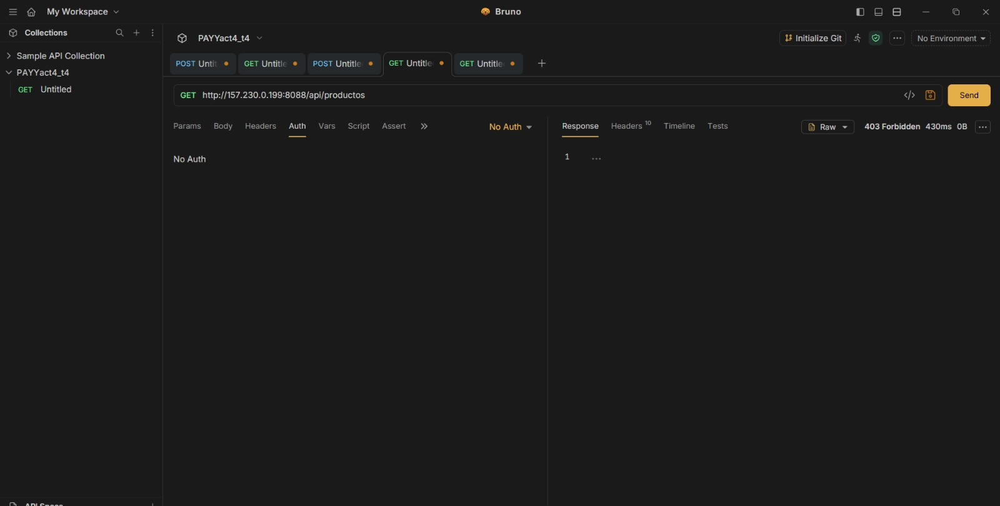
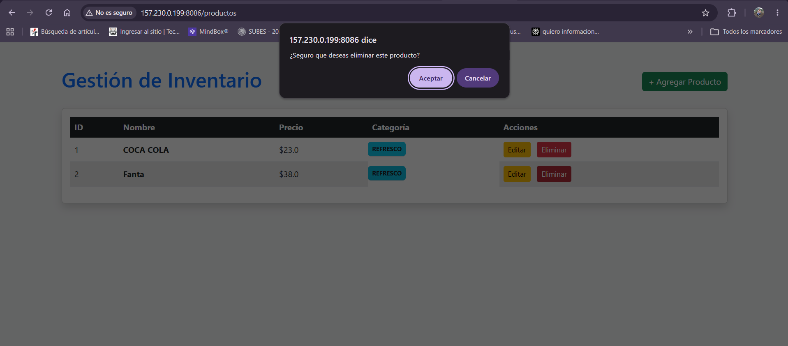
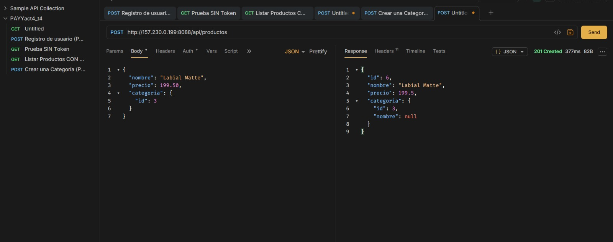
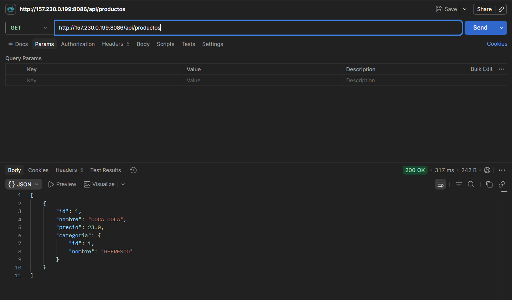
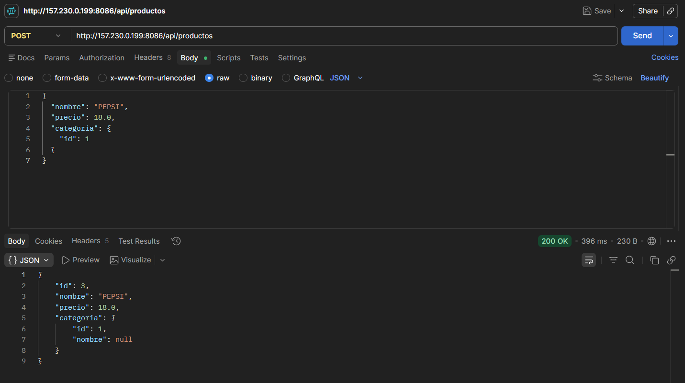
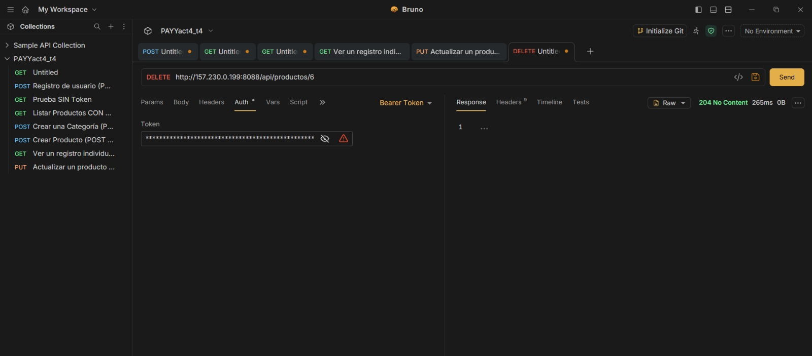

# INSTITUTO TECNOLÓGICO NACIONAL DE MÉXICO
## INSTITUTO TECNOLÓGICO DE OAXACA

**Nombre de la carrera:**  
Ingeniería en Sistemas Computacionales

**Nombre de la materia:**  
Programación Web

**Unidad:**  
Unidad 3

**Título del trabajo:**  
Actividad 4: API REST con Spring Security, JWT y Despliegue en VPS

**Alumnos:**  
Pacheco Aragon Yareli Yazmin

**Docente:**  
Adelina Martínez Nieto

**Grupo:**  
B

**Fecha de entrega:**  
21 de julio del 2026

##  Descripción del Proyecto

Este proyecto es una API REST que desarrollé con Java y Spring Boot. Sirve para gestionar un catálogo de productos y categorías  y cuenta con un sistema de seguridad que implementé usando Spring Security y JSON Web Tokens (JWT) para proteger los endpoints.

##  Evidencias de Funcionamiento

####  Registro de Usuario (POST /api/auth/register)

Se realiza el registro de un nuevo usuario en la base de datos para obtener credenciales de acceso.

Registro de usuario:

link: http://157.230.0.199:8088/api/auth/register
Body: {
  "nombre": "Yareli VPS",
  "email": "yarelivps@gmail.com",
  "password": "password123"
}

Inicio de sesión (Login / Obtener Token):

Link: http://157.230.0.199:8088/api/auth/login 

####  Prueba a Endpoint Protegido SIN Token (GET /api/productos)

Link: http://157.230.0.199:8088/api/productos

Demostración de la seguridad de la API: al intentar consultar un recurso protegido sin enviar el token de autorización, Spring Security bloquea el acceso con un estado **403 Forbidden**.

####  Crear Categoria y Producto 

Link: http://157.230.0.199:8088/api/categorias
Body: {
  "nombre": "Cosméticos"
}

Link: http://157.230.0.199:8088/api/productos
Body: {
  "nombre": "Labial Matte",
  "precio": 199.50,
  "categoria": {
    "id": 3
  }
}
Creación de una nueva categoria y un producto enviando el token en el encabezado `Authorization: Bearer <token>` y validando los campos con DTOs.

####  Listar Productos - GET (GET /api/productos)

Link: http://157.230.0.199:8088/api/productos 
Consulta general de los productos registrados en la base de datos del VPS.
 

####  Actualizar Producto - PUT (PUT /api/productos/{id})

Link: http://157.230.0.199:8088/api/productos/6
Body: {
  "nombre": "Labial Matte Modificado",
  "precio": 220.00,
  "categoria": {
    "id": 3
  }
}

Modificación de los datos de un producto existente mediante su ID.

#### Eliminar Producto - DELETE (DELETE /api/productos/{id})

Link: http://157.230.0.199:8088/api/productos/6 
Eliminación de un registro específico de la base de datos.

* **Link Base de la API (VPS):** http://157.230.0.199:8088/api
* **Colección de Bruno:** Incluida en la carpeta PAYYact4_t4_bruno del repositorio.
* **Link de repositorio:** https://github.com/yareliyazmin16/PAYYact4_t4_ 