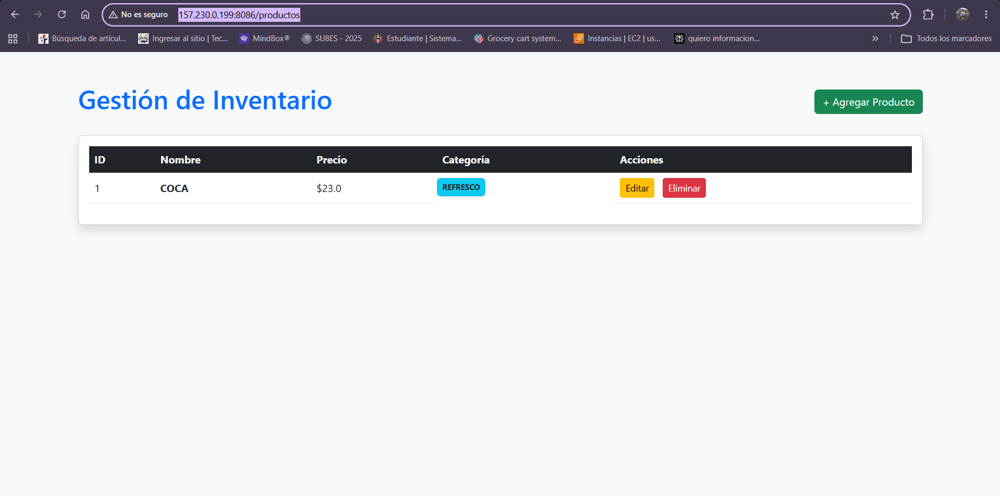
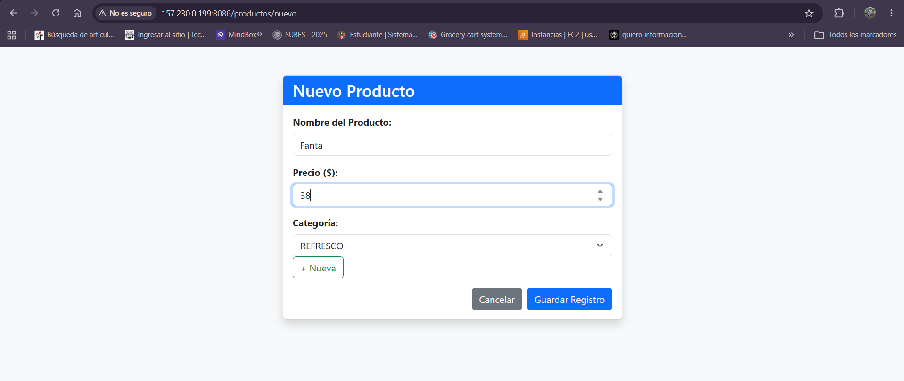
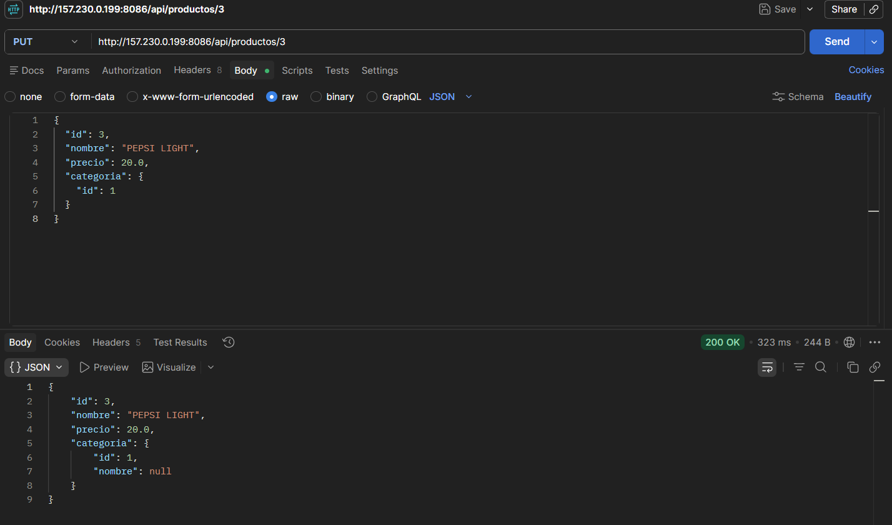
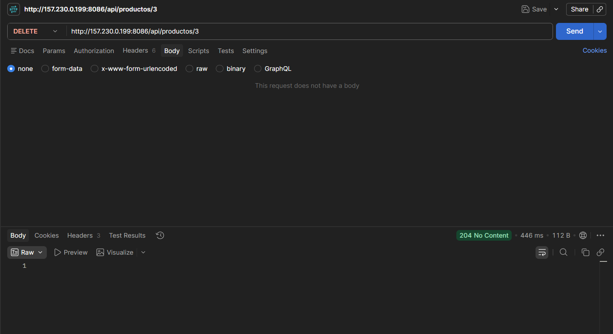

# INSTITUTO TECNOLÓGICO NACIONAL DE MÉXICO
## INSTITUTO TECNOLÓGICO DE OAXACA

**Nombre de la carrera:**  
Ingeniería en Sistemas Computacionales

**Nombre de la materia:**  
Programación Web

**Unidad:**  
Unidad 3

**Título del trabajo:**  
Act.3 CRUD en Spring Boot y Relaciones (sin frontend separado)

**Alumnos:**  
Pacheco Aragon Yareli Yazmin

**Docente:**  
Adelina Martínez Nieto

**Grupo:**  
B

**Fecha de entrega:**  
18 de julio del 2026

##  Modelo de Datos y Relación JPA

El núcleo del CRUD modela un inventario basado en dos entidades mediante una relación:

1.  **Entidad Fuerte (Categoría):** Define las clasificaciones del inventario.
2.  **Entidad Débil (Producto):** Contiene los artículos individuales.

### Relación `@ManyToOne` (Muchos a Uno)
Se implementó una relación relacional donde **Muchos Productos pertenecen a una Única Categoría**. Esto garantiza la integridad referencial mediante una llave foránea (`FOREIGN KEY`) automática en MySQL.

## Demostración del CRUD mediante Vista Web (Thymeleaf + Bootstrap)

Esta interfaz está diseñada para la interacción directa del usuario desde el navegador web.

### Crear Producto (Formulario de Registro)

Permite ingresar el nombre, precio y seleccionar mediante un menú desplegable la categoría.

*Aquí se observa la relación reflejada correctamente en producción, mostrando el nombre de la categoría asignada (**REFRESCO**) en lugar de solo su identificador numérico.*

###  Actualizar Producto (Formulario de Edición)

Extrae los datos actuales del registro mediante su ID, precarga el formulario y actualiza los campos modificados.

### Eliminar Producto (Baja Lógica/Física)

Acción que remueve el registro seleccionado de las tablas de la base de datos, refrescando la vista de inventario inmediatamente.

##  Demostración del CRUD mediante API REST (Postman - Respuestas JSON)

###  Crear Producto (POST `/api/productos`)

Petición de inserción enviando un objeto JSON en el cuerpo (`Body`) de la solicitud. Retorna el nuevo registro. 

### Leer Productos (GET `/api/productos`)

Consulta general que devuelve un arreglo JSON con código de estado `200 OK`. Se aprecia la relación con `"categoria"`, validando la relación `@ManyToOne`.

###  Actualizar Producto (PUT `/api/productos/{id}`)

Modificación total o parcial de los atributos del producto especificado en el Path Variable.

### Eliminar Producto (DELETE `/api/productos/{id}`)

Envío de la orden de eliminar el registro por ID, devolviendo una confirmación HTTP exitosa.

